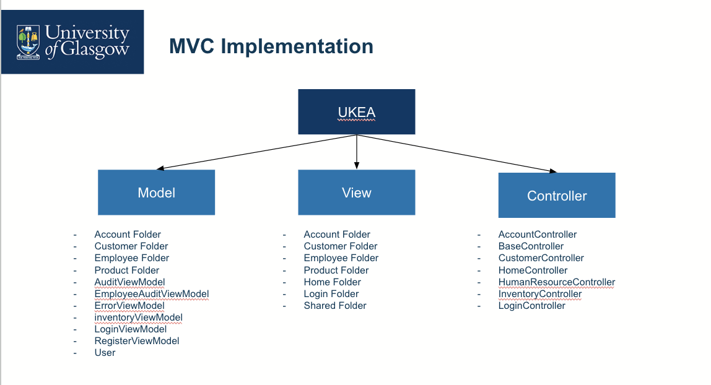
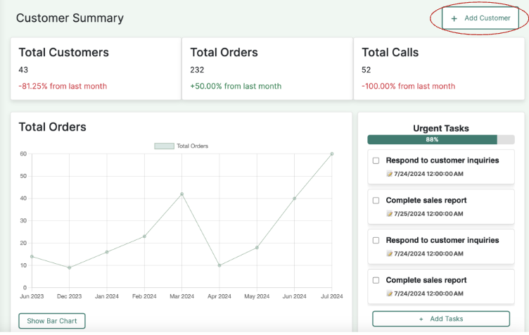
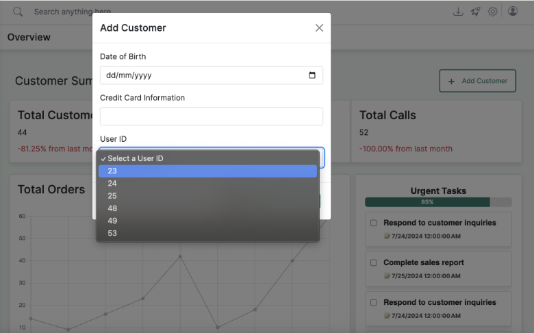
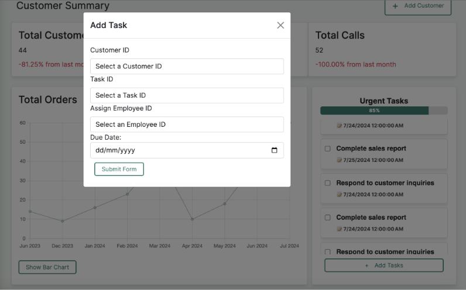
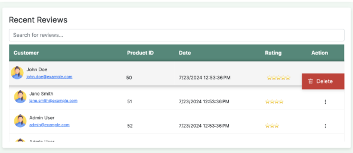

# Web Programming School Project

Customer Module Demo

Project Overview

This project is a web-based customer management system built using the Model-View-Controller (MVC) architecture. While the project includes multiple features, this README focuses on showcasing the Customer Module.

Features

Customer Summary Dashboard

Displays total customers, orders, and calls with percentage changes.

Includes a graph showing order trends.

Urgent task list with completion progress.

Adding Customers

*Click the *+ Add Customer button.

Fill in details like Date of Birth, Credit Card Information, and User ID.

Select a User ID from the dropdown list.

Adding Tasks

Assign tasks to customers using the + Add Tasks button.

Select Customer ID, Task ID, and Employee ID.

Set a due date and submit the form.

Customer Reviews Management

Displays customer reviews with ratings.

Allows deletion of reviews.

Technologies Used

Frontend: React.js

Backend: Django (REST API)

Database: PostgreSQL / MySQL

Architecture: MVC pattern

Screenshots

Below are key UI screenshots demonstrating the customer module:

Customer Summary Dashboard

Add Customer Modal

Add Task Modal

Recent Reviews Section

